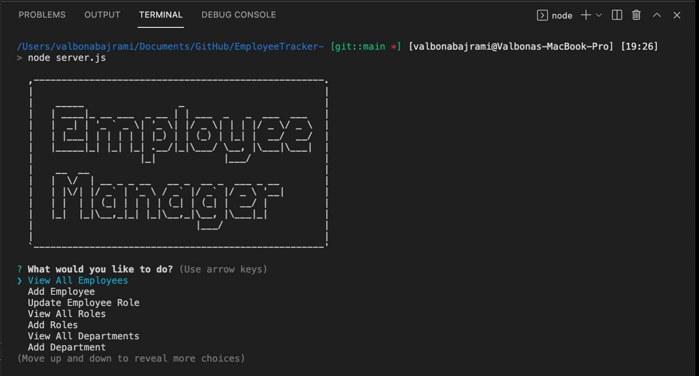
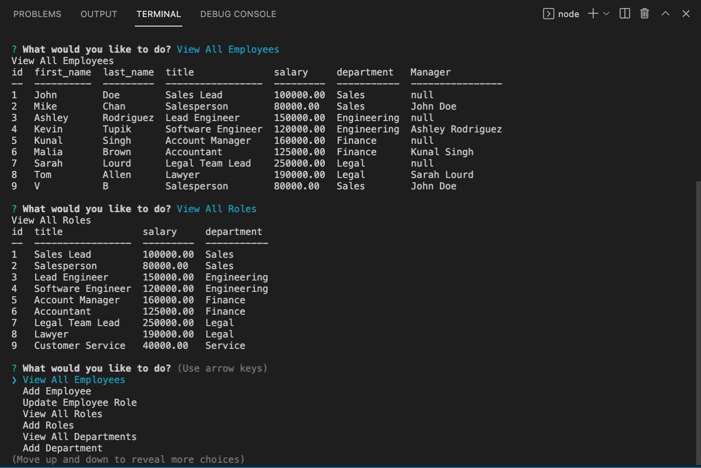

# EmployeeTracker
Developers are often tasked with creating interfaces that make it easy for non-developers to view and interact with information stored in databases. Often these interfaces are known as Content Management Systems. In this homework assignment, your challenge is to architect and build a solution for managing a company's employees using node, inquirer, and MySQL.

## Table of Contents 
  
  * [User Story](#userstory)
  * [Demo Video](#demovideo)
  * [Screenshots](#screenshots)
  * [Installation](#installation)
  * [Usage](#usage)
  * [Technology](#technology)
  * [License](#license)
  * [Contributors](#contributors)
  * [Tests](#tests)
  * [Questions](#questions)

## User Story

```
AS A business owner
I WANT to be able to view and manage the departments, roles, and employees in my company
SO THAT I can organize and plan my business
```
## Demo Video 

🎥 The full video file showing functionality of the application can be found here: [link](https://drive.google.com/file/d/1BTqh4D5bPp4s7tdBEsWY8_nkeTs9W7cD/view?usp=sharing) <br/>


## Screenshots 
A screenshot of the terminal using CML. 



## Installation
Run `npm install`. 

Use InquirerJs NPM package to interact with the user via the command-line: `npm install inquirer`.

Use console.table to print MySQL rows to the console: `npm install console.table --save`.

Use the MySQL NPM package to connect to your MySQL database: `npm install --save mysql2`.

Use CML tools for artistic logo: `npm install asciiart-logo`.

Use a dotenv npm package to add password privacy: `npm install dotenv`.

## Usage
To run locally, use the command line to navigate to the root of the application and run `node server.js`. 

## Technology
- Node.js
- MySQL
- NPM 
- ENV


## Contributors
It is an open project and everyone can contribute. Please email requesting to be added as a contributor.
  
## License
License is [MIT](https://opensource.org/licenses/MIT) standard license.

## Tests
No tests. 

## Questions
GitHub: https://github.com/valbona1992  <br/>
Email me with any questions: valbona12@gmail.com 